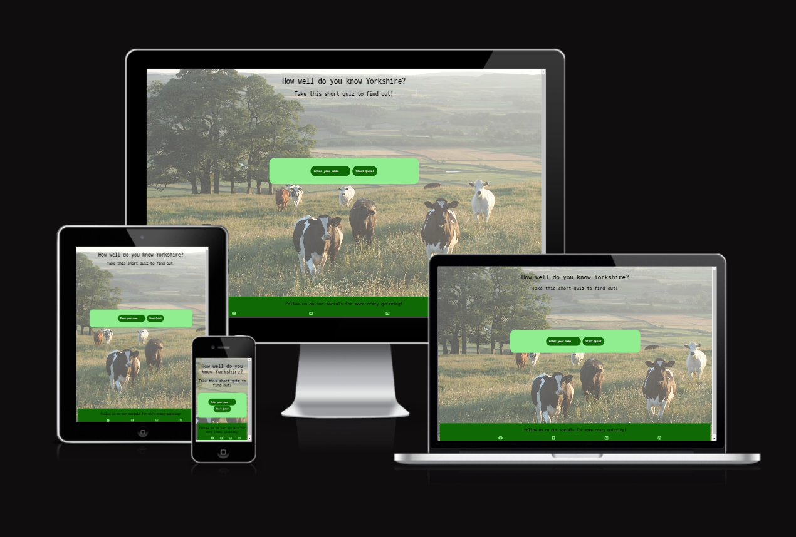

# Yorkshire Quiz
## A fun online quiz
Yorkshire Quiz is a simple, fun and easy to use quiz for family and friends to test their knowledge of the county that is Yorkshire. The quiz includes 5 challenging questions for the user to then select their answer from the multiple choice options. The site is fully responsive, easy to use, and aesthetically pleasing.

Upon entering the site, users are asked to provide a username. When a username is provided and the 'start quiz' button is pressed, users are greeted with a welcome alert, before the quiz begins. Users can then work their way through the questions, and are informed whether their answer was correct or incorrect for each question, along with the correct answer if incorrect. upon completing the quiz, users are informed of their overall score, along with a message which is dependant on whether the user scored less than 3 or not!

## Features
### Existing features

* Header
  * Featured at the top of the page, the header serves as an inviting short introduction to the quiz.
  * The header is styled with a fun font, and contrasts well with the background image.

* Quiz area
  * The quiz area features a clear and easy to understand quiz box, which includes the current question and three multiple choice buttons.
  *  The choice buttons are interactive and change color when the user hovers over the button.
  * There is a small pause between questions.

  

* Quiz results
  * The result for the current question is displayed within the quiz box, underneath the multiple choice buttons. When the user picks the incorrect answer, the current result also displays the correct answer.
  * The overall result for the quiz is displayed within the quiz box, when all questions have been answered. If the user answers less than 3 questions correctly, the result displayed includes a cheeky message encouraging them to do better next time. When the user answers 3 or more correctly, the results message includes a congratulatory message.

  

  

* Footer
  * The footer includes 4 links to social media pages, and invites the user to click on the links to find more quizzes to try.

  

### Features left to implement

* In the future, I would like to create a second user feature, so two friends can play and compete.

## Testing

* I tested this quiz in different browsers, including Safari, Firefox, and Chrome.

* I confirmed that the game results are always correct.

* I confirmed that the quiz is clear to understand and easy to use.

* I confirmed that the colors and fonts used are accessible and clear.

* I confirmed that the site is fully responsive, and looks good and functions on all screen sizes.

### Validator testing

* HTML
  * No errors were returned when passing through the official [w3c validator](https://validator.w3.org/nu/?doc=https%3A%2F%2F8000-maryyoung12-yorkshirequ-z0v9cqgnooi.ws-eu114.gitpod.io%2F)
* CSS
  * No errors were found when passing through the [official (Jigsaw) validator](https://jigsaw.w3.org/css-validator/validator?uri=https%3A%2F%2F8000-maryyoung12-yorkshirequ-z0v9cqgnooi.ws-eu114.gitpod.io%2F&profile=css3svg&usermedium=all&warning=1&vextwarning=&lang=en)
* JavaScript
  * No errors were found when passing through the official [Jshint validator](https://jshint.com/)

The following metrics were returned:

#### player.js

CONFIGURE
Metrics
There are 3 functions in this file.

Function with the largest signature take 1 arguments, while the median is 0.

Largest function has 7 statements in it, while the median is 2.

The most complex function has a cyclomatic complexity value of 3 while the median is 1.

#### script.js 

There are 5 functions in this file.

Function with the largest signature take 2 arguments, while the median is 0.

Largest function has 7 statements in it, while the median is 7.

The most complex function has a cyclomatic complexity value of 3 while the median is 1.

## Bugs
### Fixed bugs
* After deployment, I discovered that my background image wasn't working. I realised that I had typed the file path to the image wrong.
* To fix this, I fixed my file path to the image with this code.  `url("../images/yorkshire-landscape.jpg")`

### Unfixed bugs
 * No known unfixed bugs.

## Deployment

The site was deployed to GitHub pages. The steps to deploy are as follows:
* In the GitHub repository, navigate to the Settings tab
* From the source section drop-down menu, select the Master Branch
* Once the master branch has been selected, the page will be automatically refreshed with a detailed ribbon display to indicate the successful deployment.

* The live link can be found here - [Yorkshire quiz](https://maryyoung123.github.io/yorkshire-quiz/)

## Credits

The font used was sourced from [Google Fonts](https://fonts.google.com/)

The Background image was sourced from [Pexels](https://www.pexels.com/)

Advice over multiple aspects of my code has been gained from [w3Schools](https://www.w3schools.com/)

  